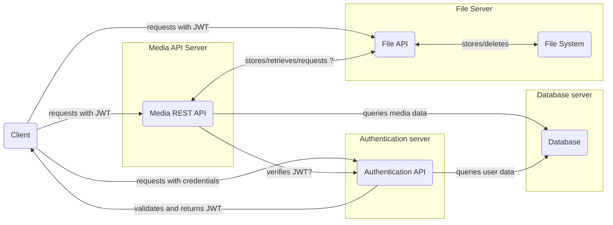

# Modular server architecture

The server system is composed of three main components: the authentication server, the REST API server and the database server. The authentication server is responsible for authenticating users and issuing JSON Web Tokens (JWTs). The REST API server is responsible for handling requests from the client and communicating with the database server. The database server is responsible for storing and retrieving data.

1. The Client makes requests to the Authentication Server for authentication.
2. Upon successful authentication, the Authentication Server returns a JWT to the Client. (All of the servers share the same secret key for verifying JWTs.)
3. The Client makes direct requests to the Media REST API Server for various operations. API server may check the validity of the shared JWT with the authentication server. 
4. The Media REST API Server queries the Database Server for data-related operations.
5. The Client may directly request resources from the File Server based on the data returned by the REST API Server.
6. The Client may directly upload files to the File server (in the example, the file data responded by the File server must be stored to the Media REST API by doing an another request)
7. The Media REST API Server and the File server may also interact with each other for deleting, storing or retrieving files.

Separating the authentication, database, REST API, and file server into distinct components in a system architecture offers several advantages compared to basic monolithic architecture:

- **Enhanced Security:**
  - Isolation of Concerns: Each server (authentication, database, etc.) can focus on a specific set of security concerns. For instance, the authentication server can be optimized for securing user credentials and managing tokens, while the database server can be focused on protecting data.
  - Reduced Risk of Cascading Failures: If one component is compromised (e.g., the file server), the other components (like the database or authentication server) remain secure, limiting the overall impact.
- **Scalability and Performance Optimization:**
  - Independent Scaling: Each component can be scaled based on its specific load and requirements. For example, you might need more resources for the file server but not for the authentication server.
  - Load Management: By distributing the workload across multiple servers, you can manage and allocate resources more efficiently.
  - Dedicated Resources: Each server can be optimized for its specific tasks, leading to better performance. For example, a database server can be optimized for fast data retrieval and storage, while a file server might be optimized for large data throughput.
  - Parallel Processing: Different servers can handle requests simultaneously, improving overall response times and throughput.
- **Maintainability and Flexibility:**
  - Easier Updates and Maintenance: Updating or maintaining one component, like the REST API, can be done without affecting the other parts of the system.
  - Modular Development: Different teams can work on different components simultaneously, reducing development time and complexity.
  - Technology Agnosticism: Each component can be built with the most suitable technology stack for its purpose without being constrained by the choices made for other components.
- **Fault Tolerance and Reliability:**
  - Reduced Impact of Failures: If one component fails (e.g., the file server), the other components (like the REST API and authentication server) can continue functioning, possibly with reduced functionality.
  - Easier Troubleshooting and Recovery: Isolating components makes it easier to identify and fix issues without impacting the entire system.

## Task: Setting up modular server architecture

1. Use the example database
1. Clone the example servers (we'll be using TypeScript from now on).
    - [Media API server](https://github.com/ilkkamtk/hybrid-media-api)
    - [Authentication server](https://github.com/ilkkamtk/hybrid-auth-server)
    - [File server](https://github.com/ilkkamtk/hybrid-upload-server)
    - [Shared types for all servers](https://github.com/ilkkamtk/hybrid-types) (included as a dev dependency in example servers)
1. Create `.env` files for all servers based on the .env.sample files
    - Add your own DB settings
    - Share the same secret key for verifying JWTs between all servers
    - Note that the servers use the same database and run concurrently on different ports
1. Install dependencies and test run the servers `npm i && npm run dev`

### Authentication server

1. Read documentation: <http://localhost:AUTH-SERVER-PORT/>
1. Test the endpoints (Postman or similar)
1. Store the JWT from _POST login_ response for testing other servers
1. Review the code (e.g. `deleteUser` function in `/src/api/models/userModel.ts` has an example how to use _SQL transactions_ with _mysql2_ package, and the route files have examples how to write _apiDoc_ annotations in code comments)

### Media API server

1. Review the code and test that the existing media endpoints work as expected
   - e.g. `GET http://localhost:3000/api/v1/media`, refer to route files for other endpoints
   - for endpoints that need authentication use the JWT as _Bearer token_
1. Start writing missing endpoints based the requirements of your individual project idea
   - **design a database for your individual project first and start writing endpoints for that**
   - remenber to update hybrid types accordingly, you may want to clone the types repo and swap to you own repo in `package.json`

### File/Upload server

1. Review the code, figure out how uploads work and how they are integrated to media api
1. Test uploading media files (You need to set the JWT as _Bearer token_)
   - Store the _json response_ details for POSTing the mediafile details to Media API server
   - In the example architecture the _client application_ needs to _POST media_ to Media API server after uploading the file to the Media API
   - Idea (optional): refactor the architecture so that after a successful file upload, the file server automatically POSTs the Media file details to Media API (or vice versa)
     - Note that the _MediaItem_ model has the _title_ and _description_ fields too 

**Returning:** Check assignment in OMA.

Start designing your individual project (see project requirements in Oma for details) and start implementing back-end features you would need for the application.

### Extras

- Security considerations
   - CORS
   - HTTPS
   - Rate limiting
   - Logging
   - Database access
   - Least Privilege Principle
   - Network security
   - Physical security
